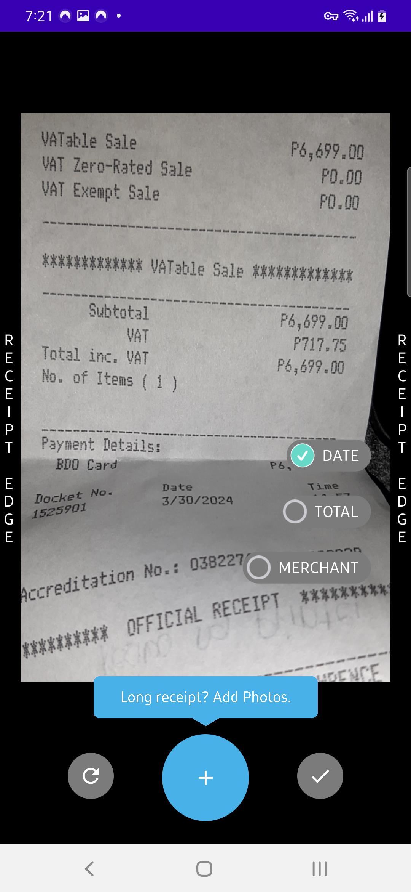
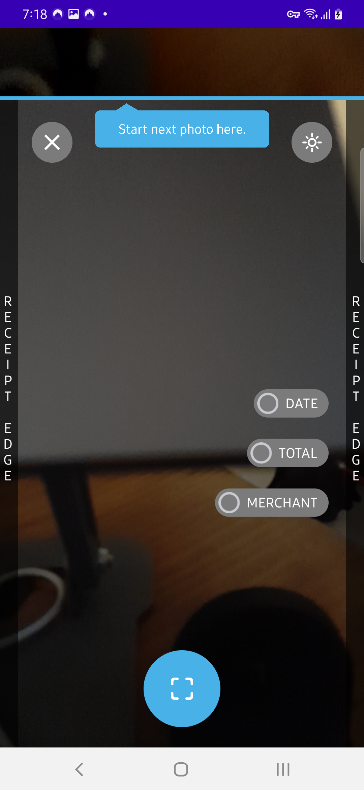
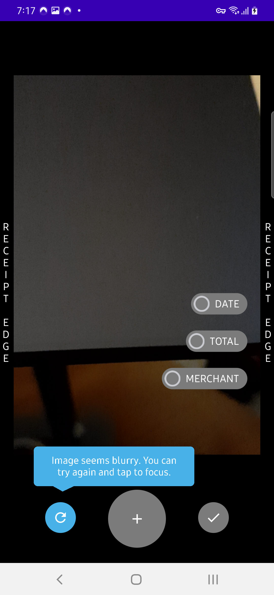
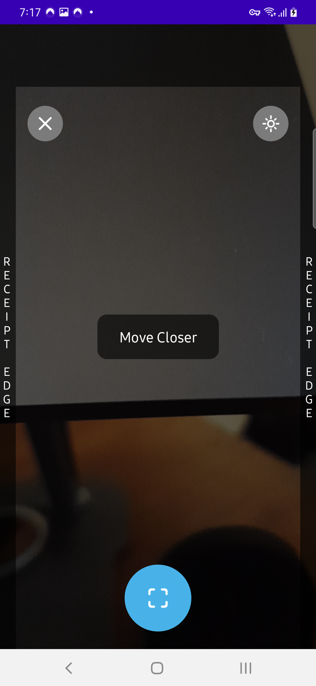
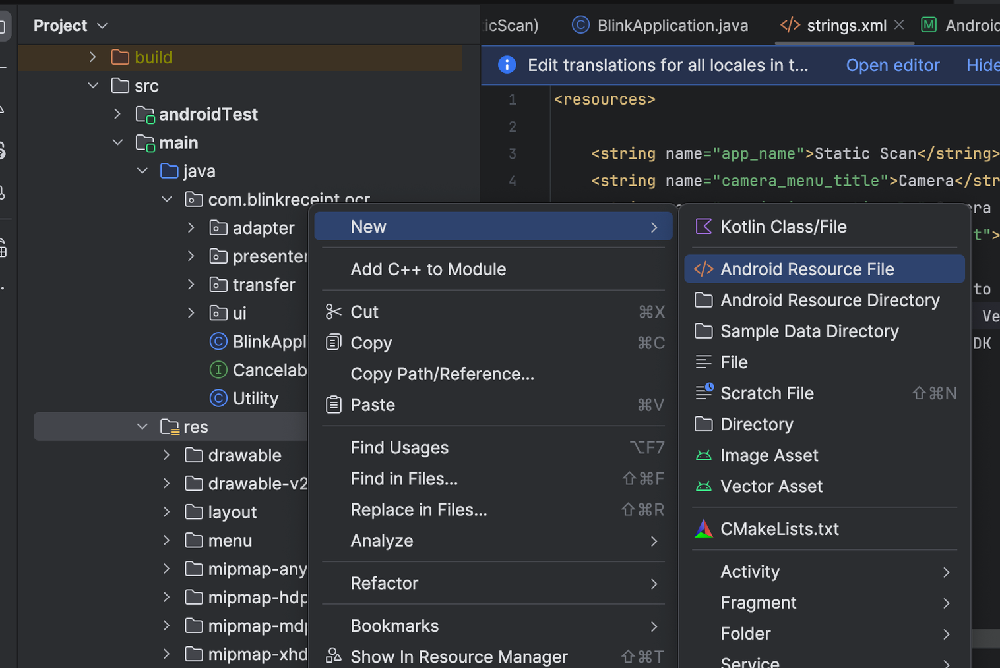
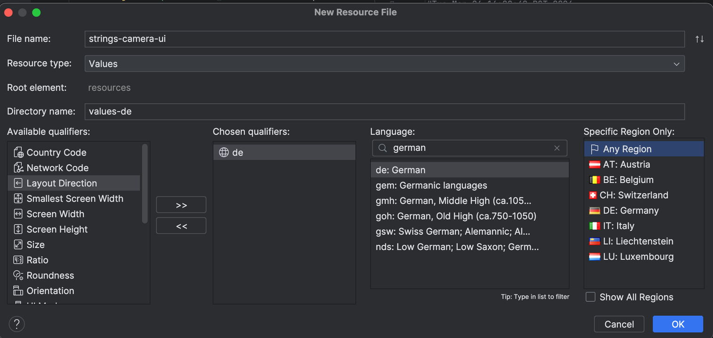

String resource mapping

| string key                                                        | English(Default)                                                  | Preview
| ---------------------------------------------------------------   | ----------------------------------------------------------------- | ----------------------------------------------------------------- |
| `recognizer_camera_long_receipt_add_photos_hint`                  | Long receipt? Add Photos.                                         | { width="300" } |
| `recognizer_camera_initial_instruction`                           | Align left and right receipt edge.<br/>Long receipt? Take multiple photos      |                                                      |
| `recognizer_align_image_hint`                                     | Start next photo here.                                            | { width="300" } |
| `recognizer_blurry_image_tooltip`                                 | Image seems blurry. You can<br/>try again and tap to focus.  | { width="300" } |
| `recognizer_missing_data_tooltip`                                 | Data missing? You can still hit<br/>checkmark to finish scan |                                                                        |
| `recognizer_blurry_image_btn`                                     | Dismiss |                                                                                                                             |
| `recognizer_move_closer_suggestion`                               | Move Closer | { width="300" } |
| `recognizer_move_further_suggestion`                              | Move Further |                                                                                                                        |
| `confirm`                                                         | confirm |                                                                                                                             |


You can apply your own translation on each string entry. This can be done by doing the following steps:

- Right click on `res` folder -> Click `New` -> Click `Android Resource File`
    - { width="300" }
- Select Qualifier Local -> <i><u>Select your desired Language</i></u>(i.e. <b>"German"</b>) -> <i><u>All Region</i></u>(or may select a specific region)
    - { width="300" }
- Provide string entry translation as desired (i.e. "German" language translation).
```xml
<?xml version="1.0" encoding="utf-8"?>
<resources xmlns:tools="http://schemas.android.com/tools">
    <!-- You can override the following labels(German) -->
    <string name="recognizer_camera_long_receipt_add_photos_hint">Lange Quittung? Fotos hinzufügen.</string>
    <string name="recognizer_camera_initial_instruction">Richten Sie die linke und rechte Bonkante aus.\nLange Quittung? Machen Sie mehrere Fotos</string>
    <string name="recognizer_align_image_hint">Beginnen Sie hier mit dem nächsten Foto.</string>
    <string name="recognizer_blurry_image_tooltip">Das Bild scheint verschwommen zu sein. Du kannst\nVersuchen Sie es erneut und tippen Sie, um zu fokussieren.</string>
    <string name="recognizer_missing_data_tooltip">Daten fehlen? Du kannst immer noch zuschlagen\nMarkieren Sie das Häkchen, um den Scanvorgang abzuschließen</string>
    <string name="recognizer_blurry_image_btn">Zurückweisen</string>
    <string name="recognizer_move_closer_suggestion">Komm näher</string>
    <string name="recognizer_move_further_suggestion">Bewegen Sie sich weiter</string>
    <string name="confirm">bestätigen</string>
</resources>
```


For more details about Android App Resource Localization, you may look at Android's official documentation [Localize your app](https://developer.android.com/guide/topics/resources/localization).
